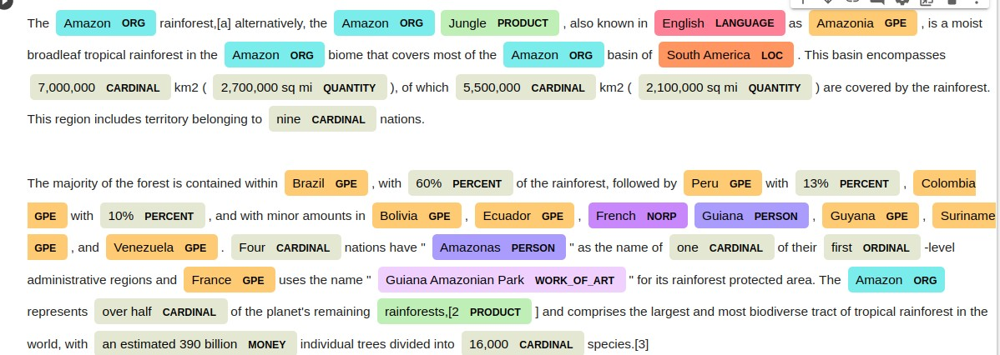

# NLP-Techniques Repository

Welcome to the NLP-Techniques repository! This repository contains code implementations and examples of various Natural Language Processing (NLP) techniques. Each technique is demonstrated using Jupyter Notebook files to provide a hands-on learning experience.

## Techniques Covered

1. **BERT Text Classification**: Demonstrates text classification using BERT (Bidirectional Encoder Representations from Transformers).
2. **Latent Semantic Analysis**: Implementation and explanation of Latent Semantic Analysis for extracting semantic relationships from documents.
3. **Named Entity Recognition (NER)**: Notebook showcasing NER, which involves identifying entities in text, such as names, locations, and organizations.
4. **Part of Speech Tagging**: Example of Part-of-Speech tagging to identify grammatical parts of words in sentences.
5. **Recurrent Neural Networks (RNN) Text Classification**: Implementation of text classification using RNNs.
6. **Convolutional Neural Networks (CNN) Text Classification**: Text classification using CNNs.
7. **Count Vectorization**: Introduction to Count Vectorization for text preprocessing.
8. **Knowledge Graph Creation and Analysis**: Notebook related to creating and analyzing knowledge graphs.
9. **Markov Model Classification**: Implementation of classification using Markov Models.
10. **TF-IDF-based Recommender System**: Notebook covering recommender systems using TF-IDF.
11. **spaCy Tutorial**: A tutorial on using spaCy, a popular NLP library.

## Usage

Feel free to explore each technique's corresponding notebook file for detailed explanations and code implementations. You can run these notebooks in your local Jupyter environment or any compatible platform.

## Contributing

Contributions are welcome! If you'd like to add more techniques, improve existing ones, or fix issues, please create a pull request.

## License

This repository is licensed under the [MIT License](LICENSE).

## Author

This repository is maintained by [Your Name]. You can contact me at [your@email.com].

