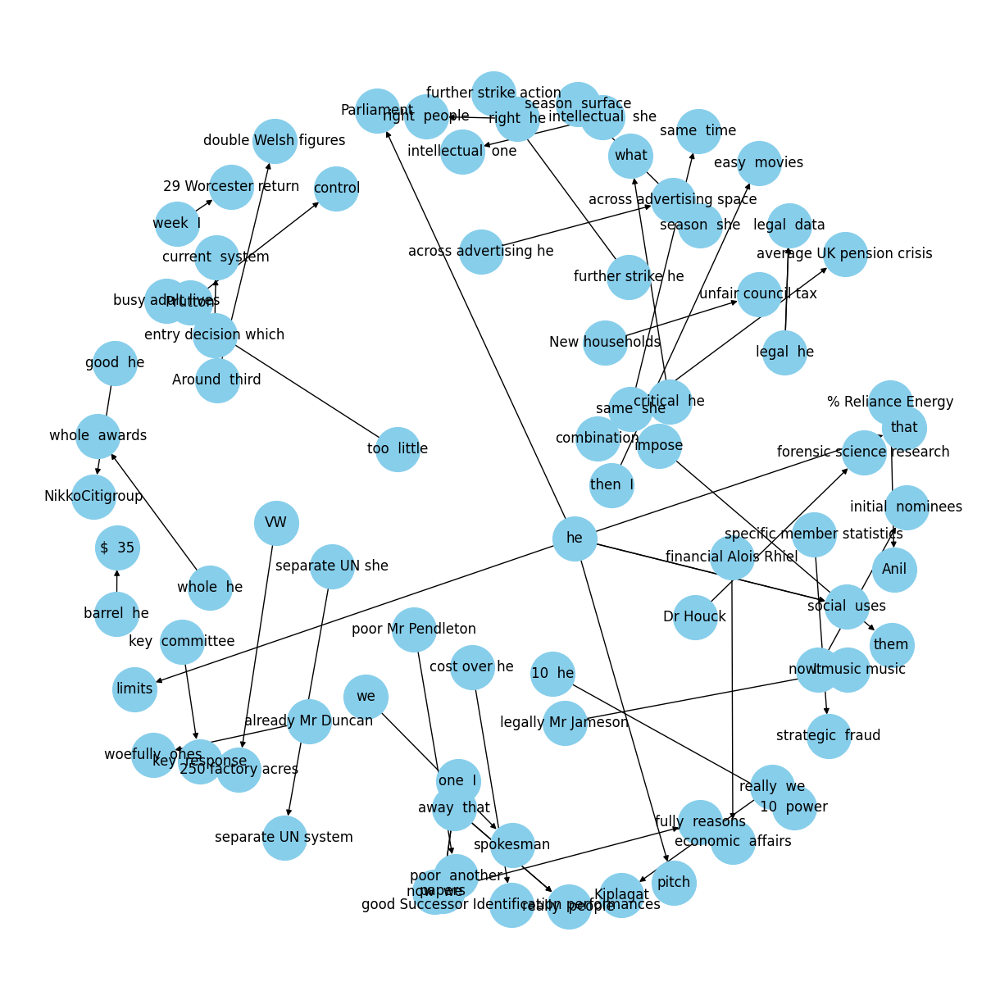

# NLP
This repositories contains code implementations of the following NLP techniques
- Count Vectorizer
- word Embedings
- Part of Speech Tagging
- Topic Modelling
- Latent Semantic Analysis
- Named Entity Recognition
- Spam Detection
- Text Classification
- CBOW
- Relationship Exraction

